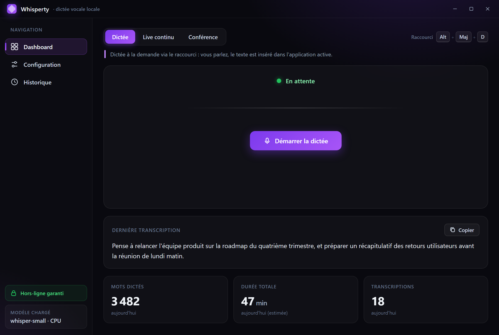
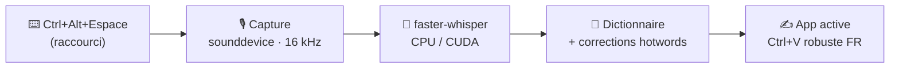

# 🎙️ Whisperty

> **Dictée vocale 100 % locale pour Windows 10/11** — une alternative libre à Superwhisper,
> propulsée par OpenAI Whisper (`faster-whisper`).

[](https://github.com/fxizel/whisperty_app/actions/workflows/ci.yml)


Appuyez sur un raccourci, parlez, relâchez : votre voix est transcrite **sur votre machine**
puis insérée directement dans l'application active — VS Code, Outlook, Teams, navigateur,
n'importe où. **Aucune donnée audio ni texte ne quitte jamais votre ordinateur.**

<p align="center">
  
  <br>
  <sub><em>Le tableau de bord : sélecteur de mode, statut temps réel, dernière transcription et statistiques du jour — 100 % local.</em></sub>
</p>



---

## Pourquoi Whisperty ?

- 🔒 **Vraiment privé** — tout tourne en local. Pas de cloud, pas de compte, pas de télémétrie.
  Seule exception : le *premier* téléchargement du modèle Whisper. Avec `local_files_only: true`
  (le **défaut**), l'app fonctionne 100 % hors-ligne — vérifiable à Wireshark.
- ⚡ **Partout dans Windows** — la transcription s'injecte dans la fenêtre active, sans copier-coller.
- 🇫🇷 **Pensé pour le français** — collage presse-papiers fiable pour les accents, dictionnaire métier, profils par application.
- 🧩 **Sans friction** — une icône dans la zone de notification, un raccourci global, un seul
  fichier `config.yaml`. Modèle manquant ? La fenêtre propose de le télécharger en un clic.
  Relancer l'exe réaffiche la fenêtre (instance unique) ; erreurs et fins de session sont
  notifiées, pas enfouies dans les logs.
- 🆓 **Libre et hackable** — Python pur, modules clairs, aucune dépendance propriétaire.

## Fonctionnalités

**Dictée**
- 🎙️ Raccourci global configurable : `toggle`, push-to-talk ou double-appui.
- 🧠 Transcription Whisper locale, **modèle configurable** (base / small / medium / large-v3), CPU ou CUDA.
- ⌨️ **Injection system-wide** dans l'app active (Ctrl+V robuste pour les accents, frappe en repli).
- 📖 **Dictionnaire personnalisé** : termes métier favorisés + corrections automatiques —
  géré depuis la fenêtre (appliqué à chaud) ou par simple fichier texte.
- 🔔 Icône tray colorée selon l'état (gris / rouge / orange / bleu / vert).

**Interface & historique**
- 🖥️ **Fenêtre WebView2** — dashboard (statut live, dernière transcription, statistiques du jour),
  configuration visuelle, gestion du dictionnaire (termes & corrections) et historique navigable
  (recherche, filtres, copie/suppression).
  La croix réduit dans la zone de notification ; fermeture définitive via « Quitter ».
- 📜 **Historique SQLite local** — purge automatique, « Copier la dernière transcription » depuis le tray.
- 📂 **Import de fichiers audio** (WAV / MP3 / M4A / FLAC…) — transcrit, copié et archivé, sans ffmpeg.
- 🔔 **Notifications utilisateur** — micro absent, modèle manquant, erreurs de dictée et résumés de session
  remontés dans l'interface et la zone de notification.

**Modes avancés**
- 🤖 **IA locale** (opt-in) — reponctuation/correction via un LLM sur la machine (Ollama, LM Studio…).
  Tout endpoint distant est refusé ; échec LLM = texte brut conservé.
- 🎯 **Profils de contexte** — prompt, langue et dictionnaire s'adaptent à l'application au premier plan
  (ex. profil « code » dans VS Code, « mail » dans Outlook).
- 🔊 **Transcription live d'une sortie audio** — loopback WASAPI continu, flux en direct dans le dashboard
  et export `.txt` horodaté.
- 🧑‍🤝‍🧑 **Mode réunion** — capture micro + sortie système simultanés, export horodaté avec distinction
  par source (`Moi` / `Interlocuteurs`), déterministe et 100 % local.
- 🗣️ **Diarisation des locuteurs** (opt-in) — au-delà de la distinction par source, étiquettes de voix
  individuelles (`Locuteur 1`, `Locuteur 2`…) via empreinte MFCC en pur NumPy, renommables depuis
  la fenêtre. Aucun modèle à télécharger.
- 📝 **Notes en session** (live / réunion) — saisie dans la fenêtre, citation d'un segment ou signet
  horodaté par raccourci global ; entrelacées chronologiquement dans le transcript.
- 📋 **Résumé de fin de session** (opt-in) — résumé par LLM local à l'arrêt d'un live ou d'une réunion,
  indépendant du raffinage de dictée ; ajouté au transcript et à l'historique.

> ⚖️ Pensez au **consentement** des participants avant d'enregistrer une réunion.

## Démarrage rapide

> **Prérequis** : Windows 10/11 64 bits, **Python 3.10+**, micro autorisé dans
> *Paramètres > Confidentialité et sécurité > Microphone*. `ffmpeg` n'est **pas** nécessaire.

**1. Installer**

```powershell
python -m venv .venv
.\.venv\Scripts\Activate.ps1
pip install -r requirements.txt
```

**2. Lancer**

```powershell
python -m whisperty                       # fenêtre + icône tray + raccourci global
python -m whisperty --no-gui              # zone de notification seule
python -m whisperty --config mon.yaml     # configuration personnalisée
```

> **Modèle absent au premier lancement ?** Le tableau de bord affiche une bannière
> « Télécharger » : un clic récupère le modèle (une seule fois, ~1,5 Go pour `medium`),
> l'installe dans `models/` et repasse l'application en 100 % hors-ligne. Pour le
> pré-stager en avance de phase : `python scripts\fetch_model.py --model medium`.

**3. Dicter**

Appuyez sur **Ctrl+Alt+Espace**, parlez, ré-appuyez (ou faites une pause) : le texte s'insère
dans la fenêtre active.

> La fenêtre utilise **Edge WebView2** (préinstallé sur Windows 10/11). Si absent, Whisperty
> démarre en **mode tray seul**.

## Configuration

Tout se règle dans **`config.yaml`** (à côté de l'exécutable). L'écran **Configuration** de
la fenêtre enregistre directement dans ce fichier en préservant les commentaires et applique
la plupart des changements à chaud.

| Section | Clés notables |
|---------|---------------|
| `audio` | `device`, `samplerate`, `vad_threshold`, `silence_duration`, `max_duration`, `sound_feedback` (bips au démarrage/arrêt de la dictée) |
| `transcription` | `model`, `language`, `device` (cpu/cuda), `compute_type`, `local_files_only` |
| `hotkey` | `mode` (toggle/push_to_talk), `combo`, `double_tap_key` |
| `output` | `method` (paste/type), `restore_clipboard`, `restore_delay` (délai avant restauration du presse-papiers — augmenter sur machine lente/RDP) |
| `dictionary` | `enabled`, `path` |
| `punctuation` | `enabled` (commandes dictées : « point », « virgule », « à la ligne »… — dictée seulement, opt-in) |
| `history` | `enabled`, `path`, `max_entries`, `max_age_days` (rétention en jours, 0 = illimité) |
| `ai` | `enabled`, `endpoint` (**local uniquement**), `model`, `prompt` |
| `profiles` | `enabled`, `definitions` |
| `live` | `device`, `block_duration`, `max_segment`, `silence_duration`, `vad_threshold`, `transcript_dir` |
| `conference` | `system_device`, `mic_device`, `distinguish_speakers`, `mic_label`/`system_label`, `speaker_diarization`, `export_dir`, `export_format` (txt/md) |
| `notes` | `bookmark_hotkey` (signet horodaté en session live/réunion ; `""` désactive le signet, la saisie dans la fenêtre reste possible) |
| `summary` | `enabled`, `prompt`, `timeout`, `max_chars` (résumé LLM local en fin de session), `template` (gabarit de compte rendu Markdown, opt-in) |
| `gui` | `enabled` (`false` ou `--no-gui` = tray seul) |

## Dictionnaire personnalisé

L'écran **Dictionnaire** de la fenêtre liste, ajoute, modifie et supprime les entrées ;
l'enregistrement est appliqué **à chaud** (la dictée suivante en bénéficie, sans redémarrage).
Le fichier **`dictionary.txt`** reste la source de vérité et peut toujours s'éditer à la main
(l'éditeur intégré préserve vos commentaires et l'ordre des entrées), une entrée par ligne :

```
terme                 # mot favorisé par la reconnaissance (hotword)
mauvais => correct    # correction appliquée après transcription
```

> En mode zone de notification seule, « Ouvrir le dictionnaire » ouvre le fichier dans
> l'éditeur système.

## Tests

La suite est **100 % hors-ligne** : toutes les dépendances matérielles sont remplacées par des
doublures dans `tests/conftest.py`. Tourne sous Windows et Linux.

```powershell
pip install -r requirements-test.txt
python -m pytest tests/ -v
python -m pytest tests/ --cov=whisperty --cov-report=term-missing
```

Une **CI GitHub Actions** (`.github/workflows/ci.yml`) exécute la suite sur Windows et Linux
(Python 3.10 → 3.12), vérifie un seuil de couverture de 80 % et passe `ruff`.

## Déploiement (installeur Windows)

```powershell
.\scripts\build.ps1            # dist\whisperty\ : exe + modèle Whisper bundlé
.\scripts\make_installer.ps1   # dist\installer\Whisperty-Setup-<version>.exe (Inno Setup)

# Distribution publique : signer pour éviter l'avertissement SmartScreen (certificat requis)
.\scripts\build.ps1 -Sign
.\scripts\make_installer.ps1 -Sign
```

L'installeur s'installe **par utilisateur** (`%LocalAppData%\Programs\Whisperty`, sans droits
admin), crée les raccourcis, propose le démarrage avec Windows, ferme proprement une instance
en cours lors d'une mise à jour et préserve config/historique. Si WebView2 manque, il propose
d'ouvrir la page de téléchargement. Variantes build : `-Model small` · `-NoModel` (l'app
proposera alors le téléchargement du modèle au premier lancement).

> **SmartScreen** (« Windows a protégé votre PC ») : l'installeur doit être signé avec un
> certificat Authenticode (OV/EV). Voir [`installer/README.md`](installer/README.md) § Signature.

> Procédure détaillée : **[`installer/README.md`](installer/README.md)**.

Pour activer le démarrage automatique sans installeur (build de dev) :

```powershell
.\scripts\install_autostart.ps1     # activer
.\scripts\uninstall_autostart.ps1   # désactiver
```

## Accélération GPU NVIDIA

Depuis l'écran **Configuration** de la fenêtre : choisir `device: cuda`, puis cliquer sur
**« Installer le support GPU »** (~1,3 Go, opt-in, suivi par progression). En build de dev,
installation manuelle possible :

```powershell
pip install nvidia-cublas-cu12 nvidia-cudnn-cu12
```

Puis dans `config.yaml` : `device: cuda` et `compute_type: float16`.

> CTranslate2 ne supporte que **CPU et CUDA**. Les GPU **AMD / Intel** restent en CPU.
> Si CUDA est demandé sans composants ni GPU, l'app retombe gracieusement sur le CPU int8.

## Architecture

Pipeline : raccourci → `recorder` → `transcriber` → post-traitement dictionnaire → `injector`,
état reflété par le `tray`, orchestré par `app.py`.

| Module (`whisperty/`) | Rôle |
|------------------------|------|
| `recorder.py` | Capture micro non bloquante (sounddevice), RMS pour VAD/tray |
| `transcriber.py` | Wrapper faster-whisper (modèle configurable, hotwords, garde hors-ligne) |
| `cuda.py` | Détection GPU/composants CUDA + installation opt-in depuis l'UI |
| `injector.py` | Injection texte (Ctrl+V par défaut, frappe en repli) |
| `tray.py` | Icône zone de notification (pystray) |
| `app.py` | Orchestration / machine à états + raccourci global + surveillance VAD |
| `config.py` · `dictionary.py` | Chargement de `config.yaml` / du dictionnaire (édition assistée depuis la fenêtre, commentaires préservés) |
| `history.py` | Historique des transcriptions (SQLite local, thread-safe) |
| `ai.py` | Raffinage texte par LLM **local** (garde localhost) |
| `profiles.py` · `winutil.py` | Profils par application + détection de l'app active (Win32) |
| `loopback.py` · `live.py` | Capture loopback (soundcard/WASAPI) + transcription live |
| `conference.py` · `diarization.py` | Mode réunion + diarisation des locuteurs (MFCC NumPy par défaut, modèle ONNX local en option) |
| `gui.py` · `web/` | Fenêtre WebView2 (pywebview) + pont Python↔JS + assets UI |
| `configio.py` | Écriture chirurgicale de `config.yaml` (préserve commentaires/ordre) |
| `modeldl.py` | Téléchargement opt-in du modèle depuis l'UI (bannière du dashboard) |
| `singleinstance.py` | Instance unique (relancer l'exe réaffiche la fenêtre) |

Détails de conception et règles de concurrence : voir [`CLAUDE.md`](CLAUDE.md).
Spécifications fonctionnelles : [`docs/specifications/`](docs/specifications/).
Origine et licences des modèles (Whisper, diarisation) : [`NOTICE.md`](NOTICE.md).
