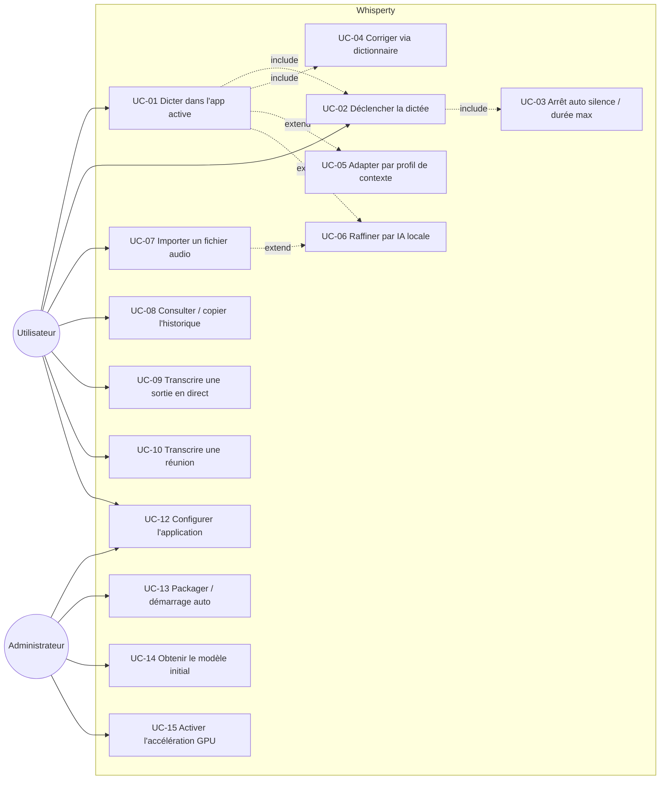
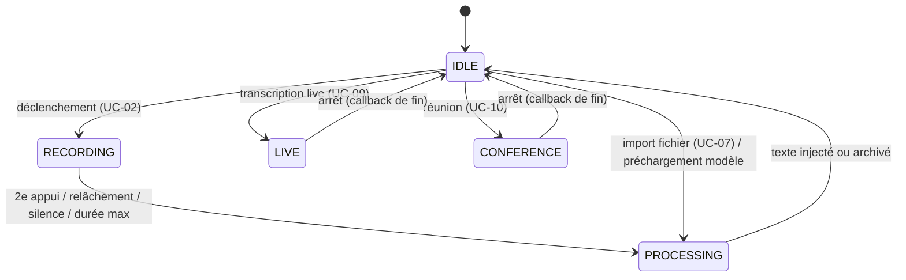

# 03 — Cas d'utilisation

## 1. Acteurs

### Acteurs humains
| Acteur | Description | Personas |
|--------|-------------|----------|
| **Utilisateur** | Personne qui dicte / transcrit / configure au quotidien. | P-01, P-02, P-04, P-05 |
| **Administrateur** | Installe, package, déploie, maintient. | P-06 |
| *(Auditeur)* | Vérifie la confidentialité — n'interagit pas directement, contraint le système. | P-03 |

### Acteurs système (secondaires)
| Acteur | Rôle dans les scénarios |
|--------|-------------------------|
| **Application active** | Cible de l'injection de texte (fenêtre Windows au premier plan). |
| **Moteur Whisper** (faster-whisper) | Transcrit l'audio en texte, localement. |
| **LLM local** | Raffine le texte (Ollama, LM Studio…), localhost uniquement. |
| **Périphérique audio** | Micro (entrée) et/ou sortie système (loopback). |

## 2. Diagramme de cas d'utilisation

> `include` = sous-fonction toujours exécutée ; `extend` = comportement optionnel/conditionnel.

## 3. Machine à états (rappel)

La dictée et les modes exclusifs partagent une machine à états sérialisée (un seul état à la
fois) ; l'icône tray en reflète la couleur.

**Règle d'exclusivité (BR-01)** : tout déclenchement reçu dans un état autre que `IDLE` (pour
les modes exclusifs) ou hors `RECORDING` (pour l'arrêt de dictée) est **ignoré** (no-op
journalisé), jamais mis en file.

## 4. Catalogue des cas d'utilisation

| UC | Titre | Acteur | Priorité | Personas |
|----|-------|--------|----------|----------|
| UC-01 | Dicter du texte dans l'application active | Utilisateur | M | P-01, P-02, P-04 |
| UC-02 | Déclencher / arrêter la dictée | Utilisateur | M | P-01, P-04 |
| UC-03 | Arrêt automatique (silence / durée max) | Système | M | P-04 |
| UC-04 | Corriger via le dictionnaire personnalisé | Utilisateur | S | P-01, P-02 |
| UC-05 | Adapter le contexte par profil applicatif | Utilisateur | C | P-01 |
| UC-06 | Raffiner le texte par IA locale | Utilisateur | C | P-01 |
| UC-07 | Importer et transcrire un fichier audio | Utilisateur | S | P-05 |
| UC-08 | Consulter / copier l'historique | Utilisateur | S | P-02, P-05 |
| UC-09 | Transcrire une sortie audio en direct (live) | Utilisateur | S | P-05 |
| UC-10 | Transcrire une réunion (micro + sortie) | Utilisateur | S | P-02, P-05 |
| UC-12 | Configurer l'application | Utilisateur / Admin | M | P-06 |
| UC-13 | Packager / activer le démarrage automatique | Administrateur | C | P-06 |
| UC-14 | Obtenir le modèle initial (1er lancement) | Utilisateur / Admin | M | P-06 |
| UC-15 | Activer l'accélération GPU NVIDIA | Administrateur | C | P-06 |

> Le persona **P-03 (RSSI/DPO)** n'apparaît pas en colonne « Personas » : il agit comme
> **acteur-contrainte** (validation du zéro-réseau, `CO-01…03`) plutôt qu'en utilisateur direct.
> Son rattachement transverse aux UC figure dans la matrice [`05` §1](05-tracabilite-et-risques.md).

---

## 5. Fiches détaillées

> Dans les fiches ci-dessous, **« Exigences liées »** est une liste *indicative* des exigences
> les plus saillantes du cas. La **traçabilité complète et bidirectionnelle** UC ↔ exigences
> fait foi dans [`05` §2–§3](05-tracabilite-et-risques.md).

### UC-01 — Dicter du texte dans l'application active

| Champ | Valeur |
|-------|--------|
| **Acteur principal** | Utilisateur |
| **Acteurs secondaires** | Moteur Whisper, Application active, (LLM local si UC-06) |
| **Objectif** | Convertir la parole en texte et l'insérer dans la fenêtre active. |
| **Déclencheur** | Raccourci global (UC-02). |
| **Préconditions** | App lancée (icône tray) ; micro autorisé ; modèle disponible ; état `IDLE`. |
| **Garanties (succès)** | Le texte transcrit (corrigé, éventuellement raffiné) est inséré dans l'app cible et archivé dans l'historique. |
| **Garanties minimales** | En cas d'échec, retour à `IDLE`, erreur journalisée localement, aucune donnée perdue ni envoyée. |

**Scénario nominal**
1. L'utilisateur déclenche la dictée (UC-02) → état `RECORDING` (icône **rouge**).
2. Le système capture le micro en 16 kHz mono (rééchantillonnage si nécessaire).
3. (Si profils activés) le système mémorise l'application au premier plan = cible (UC-05).
4. L'utilisateur arrête la dictée (2ᵉ appui / relâchement / silence / durée max) → état `PROCESSING` (icône **orange**).
5. Le moteur Whisper transcrit l'audio localement (langue forcée `fr` par défaut, hotwords du dictionnaire).
6. Le système applique les **corrections** du dictionnaire (UC-04).
7. (Si IA activée) le texte est raffiné par le LLM local (UC-06).
8. Le système **injecte** le texte dans l'app cible (collage `Ctrl+V` par défaut).
9. Le système archive la transcription (source = `dictée`) et revient à `IDLE` (icône **grise**).

**Extensions / exceptions**
- *4a. Transcription vide* (aucune parole) : rien n'est injecté, retour `IDLE`, journalisé.
- *5a. Modèle non disponible* : erreur explicite journalisée, retour `IDLE`, aucune injection.
- *2a. Micro absent / non autorisé* : l'enregistrement ne démarre pas, erreur journalisée, reste `IDLE`.
- *8a. Méthode `type`* : si configurée, frappe caractère par caractère (repli, moins fiable pour les accents).
- *7a. Échec du LLM* : le **texte brut** est conservé et injecté (non bloquant).

**Règles** : BR-01 (exclusivité), BR-02 (langue), BR-04 (collage privilégié).
**Exigences liées** : FR-01, FR-02, FR-03, FR-05, FR-07, RE-01, RE-02, PE-01, PE-02.

---

### UC-02 — Déclencher / arrêter la dictée

| Champ | Valeur |
|-------|--------|
| **Acteur principal** | Utilisateur |
| **Objectif** | Démarrer et arrêter l'enregistrement de manière ergonomique et configurable. |
| **Préconditions** | Écouteur de raccourci global actif. |

**Variantes (selon `hotkey.mode` / `double_tap_key`)**
1. **Toggle** *(défaut)* : un appui sur le combo (`<ctrl>+<alt>+<space>`) démarre ; un second appui (ou un silence, UC-03) arrête.
2. **Push-to-talk** : maintenir le combo enregistre ; relâcher arrête et transcrit.
3. **Double-appui** : si `double_tap_key` est défini (ex. `ctrl`), un double-appui rapide (< 0,4 s) démarre/arrête.

**Extensions / exceptions**
- *Combo invalide* : repli automatique sur `<ctrl>+<alt>+<space>`, avertissement journalisé.
- *Déclenchement pendant un mode exclusif / `PROCESSING`* : ignoré (BR-01).

**Exigences liées** : FR-01, US-01, RE-05, CO-09 (ne pas utiliser `Win+Space`).

---

### UC-03 — Arrêt automatique (silence / durée max)

| Champ | Valeur |
|-------|--------|
| **Acteur principal** | Système (surveillance) |
| **Objectif** | Clore l'enregistrement sans action manuelle. |

**Scénario nominal (mode toggle)**
1. Pendant `RECORDING`, le système surveille le niveau RMS.
2. Après détection de parole puis un **silence** ≥ `audio.silence_duration`, l'enregistrement s'arrête et passe en `PROCESSING`.

**Garde-fou (tous modes)**
- Si la durée atteint `audio.max_duration`, l'enregistrement est **forcé** à l'arrêt (protection mémoire / coût).
- En push-to-talk, l'arrêt provient du relâchement de touche ; seul le garde-fou de durée s'applique.

**Exigences liées** : FR-15, RE-03, PE-04.

---

### UC-04 — Corriger via le dictionnaire personnalisé

| Champ | Valeur |
|-------|--------|
| **Acteur principal** | Utilisateur |
| **Objectif** | Améliorer la fidélité du vocabulaire métier et corriger des erreurs récurrentes. |

**Mécanisme** (`dictionary.txt`, une entrée par ligne)
- `terme` → **hotword** fourni au modèle pour favoriser sa reconnaissance.
- `mauvais => correct` → **correction** appliquée *après* transcription (post-traitement).

**Préconditions** : `dictionary.enabled: true`.
**Exigences liées** : FR-07, US-04, SU-02.

---

### UC-05 — Adapter le contexte par profil applicatif

| Champ | Valeur |
|-------|--------|
| **Acteur principal** | Utilisateur |
| **Objectif** | Adapter prompt / langue / dictionnaire selon l'application visée. |

**Scénario**
1. Au **démarrage** de la dictée, le système identifie l'exécutable au premier plan (Win32, local).
2. Le **premier profil** dont un `match` est une sous-chaîne du nom d'exécutable s'applique (sinon contexte par défaut).
3. Ses `initial_prompt` / `language` / `hotwords` / `corrections` / `dictionary` surchargent le contexte de la transcription.

**Préconditions** : `profiles.enabled: true`.
**Règle** : la cible est capturée **au démarrage** (= cible de l'injection), pas à l'arrêt.
**Exigences liées** : FR-08, CO-10.

---

### UC-06 — Raffiner le texte par IA locale

| Champ | Valeur |
|-------|--------|
| **Acteur principal** | Utilisateur |
| **Acteur secondaire** | LLM local |
| **Objectif** | Corriger ponctuation, casse et fautes évidentes sans reformuler. |

**Scénario**
1. Après transcription, le texte est envoyé au LLM **local** (endpoint compatible OpenAI).
2. Le LLM renvoie le texte corrigé, qui remplace le texte brut.

**Préconditions** : `ai.enabled: true` ; endpoint **local** ; serveur LLM lancé.
**Exceptions**
- *Endpoint non local* : **refusé** par conception (CO-03) — aucune sortie de données.
- *Échec / timeout du LLM* : le **texte brut** est conservé (non bloquant).

**Exigences liées** : FR-09, CO-03, RE-06.

---

### UC-07 — Importer et transcrire un fichier audio

| Champ | Valeur |
|-------|--------|
| **Acteur principal** | Utilisateur |
| **Objectif** | Transcrire un fichier audio existant (WAV/MP3/M4A/FLAC/OGG/OPUS/WMA/AAC). |

**Scénario nominal**
1. Tray → « Importer un fichier audio… » ; un sélecteur de fichiers s'ouvre.
2. Le fichier est décodé (PyAV, **sans ffmpeg**) et transcrit localement → `PROCESSING`.
3. (Si IA) raffinage local.
4. Le texte est **copié dans le presse-papiers** (et non injecté : la cible serait ambiguë depuis le tray) et archivé (source = `fichier`).
5. Une notification confirme ; retour `IDLE`.

**Exceptions** : fichier introuvable / modèle absent / aucune parole → notification + journalisation, retour `IDLE`.
**Préconditions** : état `IDLE` ; tkinter disponible pour le sélecteur.
**Exigences liées** : FR-10, CO-07 (pas de ffmpeg), RE-02.

---

### UC-08 — Consulter / copier l'historique

| Champ | Valeur |
|-------|--------|
| **Acteur principal** | Utilisateur |
| **Objectif** | Récupérer une transcription passée. |

**Fonctions**
- « **Copier la dernière transcription** » → presse-papiers.
- « **Ouvrir le dossier de l'historique** » → explorateur sur le dossier de `whisperty.db`.

**Mécanisme** : base **SQLite locale** (`whisperty.db`), purge automatique au-delà de
`history.max_entries` (défaut 200), accès sérialisés (thread-safe), écriture non bloquante.
**Préconditions** : `history.enabled: true`.
**Exigences liées** : FR-11, RE-07, SU-03.

---

### UC-09 — Transcrire une sortie audio en direct (live)

| Champ | Valeur |
|-------|--------|
| **Acteur principal** | Utilisateur |
| **Objectif** | Transcrire en continu ce qui *sort* d'un périphérique (ex. confcall) sans importer de fichier. |

**Scénario nominal**
1. Tray → « Transcription live (sortie audio) » → choix de la sortie (défaut ou périphérique listé).
2. État `LIVE` (icône **bleue**) ; capture **loopback** (WASAPI / `soundcard`).
3. Un segmenteur VAD découpe le flux ; chaque segment est transcrit (réglages de base, **sans** profil ni LLM — priorité latence) et écrit au fil de l'eau dans `transcriptions/live_<horodatage>.txt`.
4. (Si l'**interface fenêtre** est ouverte) chaque segment s'ajoute **au fil de l'eau** à la tuile « Dernière transcription » du tableau de bord, qui devient un flux en direct (US-09) — sans attendre l'arrêt.
5. À l'arrêt (menu), le texte complet est **copié** dans le presse-papiers et archivé (source = `live`) ; retour `IDLE`.

**Exceptions**
- *`soundcard` absent / loopback indisponible* : démarrage échoue, notification, retour `IDLE`.
- *Aucun texte transcrit* : notification, pas d'archivage.
- *Fenêtre fermée / mode tray seul* : la capture, le fichier et l'archivage sont **inchangés** (l'affichage en direct est un confort, non bloquant).

**Préconditions** : `soundcard` installé.
**Exigences liées** : FR-12, US-09, RE-08, PE-03, CO-05, CO-06 (COM par thread).

---

### UC-10 — Transcrire une réunion (micro + sortie système)

| Champ | Valeur |
|-------|--------|
| **Acteur principal** | Utilisateur |
| **Objectif** | Transcrire une réunion complète : sa voix (micro) **et** les interlocuteurs distants (sortie système). |

**Scénario nominal (distinction par locuteur — défaut)**
1. Tray → « Transcription de réunion (micro + sortie) » → choix de la sortie.
2. Notification de **rappel de consentement** ; état `CONFERENCE` (icône **verte**).
3. Le micro et la sortie sont capturés **simultanément**, chacun segmenté et transcrit séparément, horodaté par position audio.
4. (Si l'**interface fenêtre** est ouverte) chaque segment transcrit s'affiche **au fil de l'eau** dans la tuile « Dernière transcription » du tableau de bord (flux en direct, ligne `[MM:SS] Moi/Interlocuteurs : …`) — US-09.
5. À l'arrêt, les segments des deux sources sont **entrelacés chronologiquement** et exportés (`.txt`/`.md` horodaté) :
   `[MM:SS] Moi : …` / `[MM:SS] Interlocuteurs : …`.
6. Le transcript est archivé (source = `réunion`) ; **non injecté** ; retour `IDLE`.

**Variante (itération 1 — `distinguish_speakers: false`)** : les deux sources sont **mixées**
en une transcription continue sans étiquette de locuteur.

**Exceptions / robustesse**
- *Une source manque ou meurt en cours* : l'autre source est utilisée seule (la source morte est retirée pour ne pas geler l'alignement).
- *Aucune source* : démarrage échoue, notification.
- *Fenêtre fermée / mode tray seul* : capture, export et archivage **inchangés** (l'affichage en direct est un confort, non bloquant).

**Préconditions** : `conference.enabled: true` ; `soundcard` ; **consentement** des participants (BR-05).
**Exigences liées** : FR-13, US-09, RE-08, RE-09, CO-04, CO-05, BR-05.

---

### UC-12 — Configurer l'application

| Champ | Valeur |
|-------|--------|
| **Acteur principal** | Utilisateur / Administrateur |
| **Objectif** | Régler le comportement via un fichier unique. |

**Scénario**
1. Tray → « Ouvrir la configuration » ouvre `config.yaml`.
2. L'utilisateur édite les sections (audio, transcription, hotkey, output, dictionary, history, ai, profiles, live, conference).
3. **Relance** de l'application pour prise en compte.

**Règle** : un seul fichier `config.yaml` abondamment commenté fait foi ; le dictionnaire est dans `dictionary.txt`.
**Exigences liées** : FR-17, SU-01, US-05.

---

### UC-13 — Packager / activer le démarrage automatique *(Admin)*

| Champ | Valeur |
|-------|--------|
| **Acteur principal** | Administrateur |
| **Objectif** | Produire un exécutable autonome et lancer Whisperty au démarrage de Windows. |

**Scénario**
1. `pyinstaller whisperty.spec` → `dist\whisperty.exe` (onefile, `upx=False`).
2. Copier `config.yaml` et `dictionary.txt` **à côté** de l'exe (non embarqués, éditables).
3. `scripts\install_autostart.ps1` (par utilisateur, sans droits admin) ; désinstallation par le script inverse.

**Exigences liées** : FR-17, SU-04, CO-08 (config non embarqué), CO-11 (`upx=False`).

---

### UC-14 — Obtenir le modèle initial (premier lancement)

| Champ | Valeur |
|-------|--------|
| **Acteur principal** | Utilisateur / Administrateur |
| **Objectif** | Mettre en cache le modèle Whisper, **unique** opération réseau tolérée. |

**Scénario**
1. Récupérer le modèle (`python -c "from faster_whisper import WhisperModel; WhisperModel('medium')"` — adaptez `'medium'` au `model` de votre `config.yaml`) **ou** passer ponctuellement `local_files_only: false`, lancer une fois, puis remettre `true`.
2. Ensuite, fonctionnement 100 % hors-ligne : `local_files_only` est passé inconditionnellement à `WhisperModel` ; `HF_HUB_OFFLINE`/`TRANSFORMERS_OFFLINE` sont posés par défaut (`setdefault`).

**Exigences liées** : CO-01, CO-02, PE-02 (préchargement).

---

### UC-15 — Activer l'accélération GPU NVIDIA *(Admin)*

| Champ | Valeur |
|-------|--------|
| **Acteur principal** | Administrateur |
| **Objectif** | Accélérer la transcription sur GPU NVIDIA. |

**Scénario**
1. `pip install nvidia-cublas-cu12 nvidia-cudnn-cu12`.
2. `config.yaml` : `device: cuda`, `compute_type: float16`.

**Contrainte** : CPU et CUDA uniquement — **pas** de DirectML (AMD/Intel restent en CPU `int8`).
**Exigences liées** : FR-03, PE-01, CO-12.
